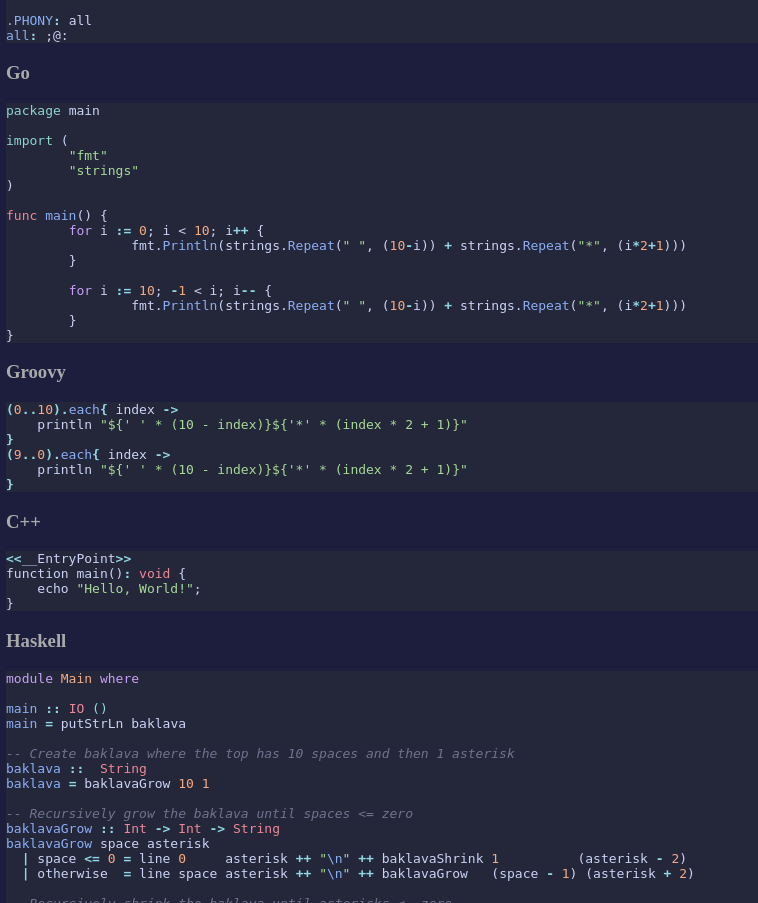

# Chroma code renderer custom style helper

Did you want to customize your [Hugo](https://gohugo.io/) blogs code highlighting outside of the pre-made themes?

Did you notice that it's hard to know what class you should be using for what language to get the desired results?

Did you find out there's a bunch of Chroma token names that map to who-knows-what CSS class names?

Did you manage to write some sort of XML already but have no idea how to map it into CSS?

Try `chroma-styler` to

- Render every supported language in a single HTML page to see what your styles look like
  - (as well as getting every possible class you can even encounter in the single page)
- Dump all the Chroma XML entry->CSS class name entries
- Generate a CSS file ready to ship



## Usage

### Style viewer

```sh
go run cmd/chroma-styler/main.go -viewer -css data/syntax.catppuccin-machiato.example.css
open localhost:3000 # In web browser or through xdg-open :)
```

Replace the `-css` with your custom file.

### Chroma token -> CSS dumper

```sh
go run cmd/chroma-styler/main.go -dump-types
```

### Chroma XML -> CSS converter

```sh
go run cmd/chroma-styler/main.go -input data/catppuccin-machiato.xml > syntax.css
```

Replace `-input` with your Chroma-compatible XML file.

> If you want to get your Neovim highlights into an XML file, you can get [inspiration from my config tool](https://github.com/puttehi/nvim-puttehi-dark/tree/main?tab=readme-ov-file#chroma-xml-generator).

### Updating generated samples

Bump the submodule commit and:

```sh
go generate ./...
```

Generator picks the first found sample.
